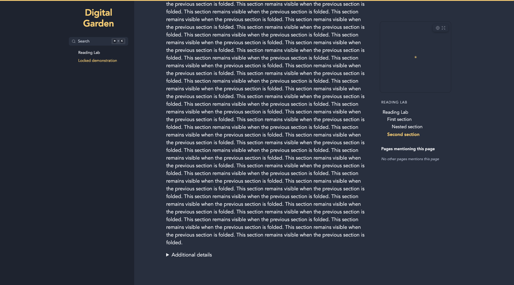

# Reading Progress & Resume

A theme-aware reading progress bar with reading-time estimates and optional per-note resume prompts.

## Installation

In Obsidian: Settings > Digital Garden > Plugins > Manage plugins > Browse & install. Until listed in the community gallery, use Install from GitHub with `koltensaccount/garden-plugin-reading-progress`. A garden with current plugin support is required. Installation is file copying only; no setup scripts or dependencies need to run on the garden. Save settings and let the site rebuild.

## Usage

Progress uses the visible note height and responds to folding, width changes and image loading. Reading time estimates the complete note at 220 words/minute by default. Optional resume offers a button rather than moving the reader automatically. Positions are saved locally per URL, never while printing or viewing a locked note. Canvas pages are excluded.

## Settings

| Key | Setting | Default |
| --- | --- | --- |
| `height` | Bar height (px) | 3 |
| `bottom` | Place at bottom of screen | false |
| `showTrack` | Show subtle background track | true |
| `hideOnShortNotes` | Hide on notes shorter than one screen | true |
| `showReadingTime` | Show estimated reading time | true |
| `resumeReading` | Offer resume reading | false |
| `wordsPerMinute` | Reading speed (words/minute) | 220 |

## Compatibility and Accessibility

Works alone and with the other reading plugins. Shared footer controls use the neutral `dg-nav-tools` convention, with a floating fallback when navigation is absent. Each plugin ships the helper it needs; none imports another plugin. Current Digital Garden uses full-document navigation. Initialization is idempotent. Native controls, accessible labels, focus outlines and appropriate ARIA states are retained. Print styles remain separate from screen preferences. Browser storage failures fall back safely.

## Development

Node 22+; `npm ci`, `npm run check`, `npm test`. Tests use Node's test runner and Playwright's driver with an installed Chrome/Edge browser (`CHROME_PATH` overrides discovery). CI uses Ubuntu's Chrome. Browser tests never invoke an OS print dialog. The plugin files are ready to copy directly into `src/plugins/reading-progress/` in a current test garden. Real upstream integration and combination checks are reported in `VALIDATION.md`.

## License

MIT, copyright 2026 Kolten Bendickson.
